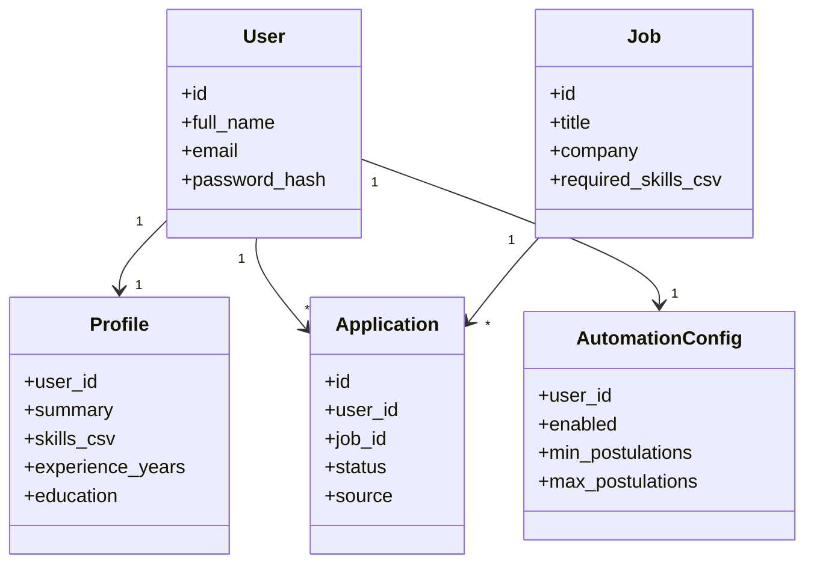
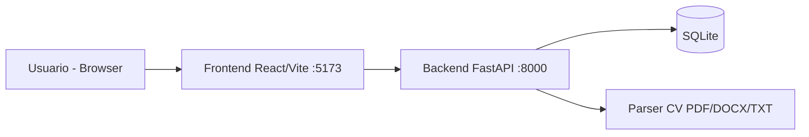

# Entrega 3 - Producto funcional

## Portada

**Proyecto:** Profile Manager - Plataforma de gestion de perfil y postulaciones  
**Curso:** Ingenieria de Software  
**Entrega:** 3 (Producto funcional)  
**Integrantes:** Juan Jose Acevedo, Daniel Marquez, Leandro Cardona, Andres Mazo  
**Docente/PO:** Elizabeth Suescun Monsalve  
**Fecha:** 2026

---

## Tabla de contenido

1. Seccion 1: Aspectos generales de la entrega  
2. Seccion 2: Evaluacion Sprint anterior  
3. Seccion 3: Planificacion Sprint actual  
4. Seccion 4: Aspectos estructurales y arquitectonicos de la solucion  
5. Seccion 5: Principios y patrones de diseno  
6. Seccion 6: Funcionalidad y demostracion  
7. Conclusiones y lecciones aprendidas  
8. Referencias

---

## Seccion 1: Aspectos generales de la entrega

### Introduccion

El proyecto **Profile Manager** nace de la necesidad de apoyar a un candidato en su proceso de busqueda laboral de forma mas ordenada y basada en datos. En la practica, muchos usuarios tienen su informacion profesional dispersa, postulan sin criterio de afinidad y pierden trazabilidad del estado de cada proceso.  

Para resolver esta problematica se implemento una solucion web full stack con cuatro ejes funcionales: (1) construccion y edicion de perfil profesional, (2) recomendaciones de vacantes por score de compatibilidad, (3) postulacion manual, asistida y automatica, y (4) seguimiento de estados del proceso.  

En esta entrega se presenta el estado funcional del producto, la evaluacion del sprint anterior, la planificacion actual, la arquitectura implementada, la aplicacion de principios/patrones de diseno y la demostracion de funcionalidades clave con soporte tecnico.

---

## Seccion 2: Evaluacion Sprint anterior

### Retrospectiva

Se realizo retrospectiva con enfoque **Start - Stop - Continue**:

- **Start:** fortalecer validaciones de backend y mensajes de error en frontend.
- **Stop:** depender de datos mock sin persistencia para validar flujos reales.
- **Continue:** integracion incremental y validacion continua con pruebas manuales de punta a punta.

Ceremonias registradas durante el sprint:

- Dailies/weekly de seguimiento tecnico con estado de tareas y bloqueos.
- Sprint review con demostracion de flujo completo ante PO y lider tecnico.
- Retrospectiva formal con acuerdos accionables para el sprint siguiente.

### Hallazgos del sprint previo

- Habia friccion en login/registro por usuarios legacy sin hash de contrasena.
- La extraccion de CV era funcional, pero limitada en datos personales y experiencia.
- El seguimiento simulado era demasiado lineal y terminaba en rechazo con alta frecuencia.
- Faltaba ampliar cobertura de vacantes para perfiles no tecnologicos.

### Acciones de mejora ejecutadas

1. Migracion de usuarios legacy al primer login para resolver autenticacion.
2. Extraccion de CV mejorada (texto y archivos) con parser dedicado.
3. Simulador de estados probabilistico con nuevos resultados realistas (`Aceptado`/`Rechazado`).
4. Inclusion de vacantes de negociacion internacional + tags de matching.
5. Actualizacion de README y documentacion tecnica para soporte de demo.

> Evidencias sugeridas para anexar en Word:
> - Capturas de retrospectiva (tablero/acta).
> - Capturas de daily/weekly.
> - Enlaces a issues/commits cerrados.

---

## Seccion 3: Planificacion Sprint actual

### Historias de usuario priorizadas (Sprint 2)

1. **US 1.3:** Como candidato, quiero un agente por chat que me pregunte datos faltantes para completar mi perfil.  
2. **US 2.3:** Como candidato, quiero notificaciones simuladas de "matches de hoy".  
3. **US 3.3:** Como candidato, quiero configurar reglas de autopostulacion (min/max, frecuencia, filtros).  
4. **US 4.3:** Como candidato, quiero una vista calendario de entrevistas programadas.

### Estimacion (Poker Planning)

Se uso estimacion relativa por complejidad (Planning Poker):

- US 1.3: 8 pts  
- US 2.3: 5 pts  
- US 3.3: 8 pts  
- US 4.3: 5 pts

Total estimado Sprint 2: **26 puntos**.

### Cambios en backlog y tablero

- Se agregaron tareas tecnicas de:
  - migracion de autenticacion legacy,
  - timeout/control de red en cliente API,
  - mejoras de parser CV,
  - ajuste de simulacion de estados,
  - ampliacion de seed de vacantes por dominios.

El tablero de sprint debe reflejar:

- columnas de estado por sprint y `Done`,
- responsables por historia,
- estimacion de puntos y criterios de aceptacion.

> Evidencias sugeridas:
> - Link sprint backlog (GitHub Projects / Azure Boards).
> - Capturas de planning + poker planning.

---

## Seccion 4: Aspectos estructurales y arquitectonicos de la solucion

### Arquitectura propuesta

Se implemento una arquitectura **cliente-servidor por capas**. El frontend (React) consume una API REST (FastAPI) organizada por dominios funcionales (`users`, `profile`, `jobs`, `applications`, `home`).  

El backend aplica una capa de rutas/controladores, una capa de servicios (matching, parser de CV, automatizacion), una capa de modelos/schemas y persistencia SQLite via SQLModel. Esta separacion permite evolucion independiente de UI, logica de negocio y acceso a datos.

### Resumen de arquitectura

- **Tipo de aplicacion:** Web
- **Estilo arquitectonico principal:** Client/Server + Layered + Component-Based + Object-Oriented
- **Lenguajes:** Python, JavaScript
- **Persistencia:** SQLite
- **Frameworks/Librerias clave:** FastAPI, SQLModel, Pydantic, React, Vite, Tailwind CSS
- **Integracion de archivos CV:** `python-docx`, `pypdf`, `python-multipart`

### Arbol de directorios (resumen)

```text
Codex/
├── backend/
│   ├── app/
│   │   ├── routes/           # Endpoints REST
│   │   ├── services/         # Reglas de negocio
│   │   ├── models.py         # Entidades
│   │   ├── schemas.py        # Contratos API
│   │   └── security.py       # Sanitizacion y hash
│   └── main.py               # Bootstrap API
└── frontend/
    └── src/
        ├── pages/            # Home, Perfil, Postulaciones, Seguimiento
        ├── components/       # UI reusable
        ├── api/client.js     # Cliente HTTP centralizado
        └── utils/            # Simulador de tracking
```

### Vista logica - Diagrama de clases de implementacion (simplificado)



### Vista fisica - Diagrama de despliegue (simplificado)



### Persistencia

Se usa **SQLite** por ser ligera, portable y suficiente para el alcance academico. Permite validar integridad funcional, relaciones y persistencia real sin sobrecostos de infraestructura.  

Entidades principales persistidas:

- `User`
- `Profile`
- `Job`
- `Application`
- `AutomationConfig`

---

## Seccion 5: Principios y patrones de diseno

## 5.1 Principios SOLID (analisis en este proyecto)

### Single Responsibility Principle (SRP)

- `cv_parser.py` concentra parseo/extraccion de CV.
- `matching.py` concentra logica de score/recomendacion.
- `routes/*.py` manejan coordinacion HTTP, no reglas complejas.

### Open/Closed Principle (OCP)

- Se agregaron nuevos perfiles (ej. negociador internacional) extendiendo
  listas de skills/tags sin reescribir toda la arquitectura.

### Liskov Substitution (LSP)

- Uso consistente de modelos/schemas tipados en rutas; las respuestas cumplen
  los contratos definidos sin romper consumidores.

### Interface Segregation (ISP)

- API segmentada por dominio (`users`, `profile`, `jobs`, `applications`, `home`);
  el cliente consume solo endpoints necesarios por modulo.

### Dependency Inversion (DIP)

- Rutas dependen de abstracciones de framework (`Depends(get_session)`) en lugar
  de acoplarse a instancias globales concretas.

## 5.2 Patrones GRASP (analisis en este proyecto)

- **Experto:** `matching.py` conoce reglas de score y afinidad.
- **Controlador:** `routes/*.py` reciben eventos HTTP y orquestan caso de uso.
- **Alta cohesion:** cada modulo agrupa responsabilidades relacionadas.
- **Bajo acoplamiento:** frontend aislado del motor interno de scoring.
- **Indireccion:** `api/client.js` centraliza llamadas HTTP entre UI y backend.
- **Variaciones protegidas:** fallback/error handling para red y dependencias opcionales (docx/pdf).

## 5.3 Clean Code aplicado

- Nombres expresivos (`extract_profile_file`, `runSimulationTick`).
- Funciones pequenas con proposito claro.
- Validaciones y manejo de errores con mensajes comprensibles.
- Modularidad por carpetas y dominio.
- Eliminacion de magia en UI con utilidades (`getScoreTone`, simulador).

---

## Seccion 6: Patrones de diseno

> Se incluyen patrones usados o claramente evidenciables en implementacion.

### Patron 1 - Strategy (comportamiento)

- **Intencion:** variar comportamiento de postulacion segun estrategia.
- **Aplicacion:** manual/asistida/automatica en `PostulacionesPage` + endpoints.
- **Participantes:** UI de acciones, rutas `/manual`, `/assisted`, `/automation/run`.
- **Consecuencia:** flexibilidad para cambiar politica de postulacion.

### Patron 2 - Factory Method (creacion)

- **Intencion:** crear objetos `Application` segun contexto.
- **Aplicacion:** rutas backend crean instancias con metadatos distintos (`source`).
- **Consecuencia:** construccion uniforme de entidades y menor duplicacion.

### Patron 3 - Repository (estructura de acceso a datos)

- **Intencion:** encapsular acceso a persistencia.
- **Aplicacion:** uso centralizado de `Session`/queries SQLModel en capa backend.
- **Consecuencia:** separa logica de negocio de detalles SQL.

### Patron 4 - Adapter (estructura)

- **Intencion:** adaptar diferentes formatos de CV a texto comun.
- **Aplicacion:** `extract_text_from_upload` convierte TXT/PDF/DOCX a texto plano.
- **Consecuencia:** unifica flujo de extraccion y reutiliza parser principal.

### Patron 5 - Facade (estructura)

- **Intencion:** simplificar consumo de API en frontend.
- **Aplicacion:** `api/client.js` expone metodos semanticos (`loginUser`, `getHome`, etc.).
- **Consecuencia:** reduce complejidad y repeticion en paginas/componentes.

---

## Seccion 7: Funcionalidad y demostracion

### Repositorio

- GitHub: <https://github.com/jjacevedo/profile-manager-ingenieria-de-software>

### Historias implementadas a demostrar (minimo 3)

1. Registro/inicio de sesion de usuario.
2. Carga de CV (texto y archivo) + extraccion automatica de perfil.
3. Recomendaciones con score y semaforo.
4. Postulacion manual y asistida.
5. Seguimiento con timeline e historial automatico simulado.

### Evidencia de acceso a datos y manipulacion

- **Lectura:** `GET /api/jobs/recommendations/{user_id}`, `GET /api/applications/{user_id}`.
- **Insercion:** `POST /api/users`, `POST /api/applications/manual`.
- **Actualizacion:** `PUT /api/profile/{user_id}`, `PUT /api/applications/automation/{user_id}`.

### Punto tecnico clave para explicar en sustentacion: calculo del score

El score de recomendacion se obtiene comparando habilidades del perfil con habilidades requeridas de cada vacante:

1. Se parsea `required_skills_csv` de la vacante.
2. Se parsea `skills_csv` del perfil.
3. Se calcula score base por porcentaje de coincidencias.
4. Se aplica bonus por afinidad de perfil/tag (chef, arquitecto, negociador, etc.).
5. Se limita a 100 y se genera una explicacion textual.

Esto permite una recomendacion **explicable**, no caja negra.

> Nota para sustentacion: `Aceptado` hoy se usa en la simulacion del frontend
> (seguimiento visual), mientras que los estados persistidos en backend incluyen
> `Postulado`, `En revisión`, `Entrevista` y `Rechazado`.

---

## Conclusiones y lecciones aprendidas

1. La separacion por capas y modulos acelero la evolucion del producto sin romper funcionalidades previas.
2. Las mejoras de robustez (timeouts, manejo de errores, migracion de usuarios legacy) fueron claves para experiencia de usuario estable.
3. La combinacion de reglas explicables para parser/matching logro buen equilibrio entre simplicidad y valor funcional.
4. El seguimiento simulado, aunque no conectado a ATS real, cumple objetivo pedagogico al demostrar estados, timeline y trazabilidad.
5. Para siguiente iteracion, se recomienda fortalecer seguridad (JWT), observabilidad y despliegue cloud.

---

## Referencias

1. FastAPI Documentation. <https://fastapi.tiangolo.com/>  
2. SQLModel Documentation. <https://sqlmodel.tiangolo.com/>  
3. React Documentation. <https://react.dev/>  
4. Vite Documentation. <https://vitejs.dev/>  
5. Tailwind CSS Documentation. <https://tailwindcss.com/docs>  
6. Python `pypdf` Documentation. <https://pypdf.readthedocs.io/>  
7. python-docx Documentation. <https://python-docx.readthedocs.io/>  
8. Martin, R. C. *Clean Code: A Handbook of Agile Software Craftsmanship*. Prentice Hall.  
9. Gamma, E., Helm, R., Johnson, R., Vlissides, J. *Design Patterns*. Addison-Wesley.

---

## Anexos sugeridos (para version final en Word)

- Capturas de planning, retrospectiva, dailies/weekly.
- Capturas del backlog/sprint board.
- Capturas de la app en: login, perfil, recomendaciones, postulaciones y seguimiento.
- Evidencia de commits relevantes por sprint.
